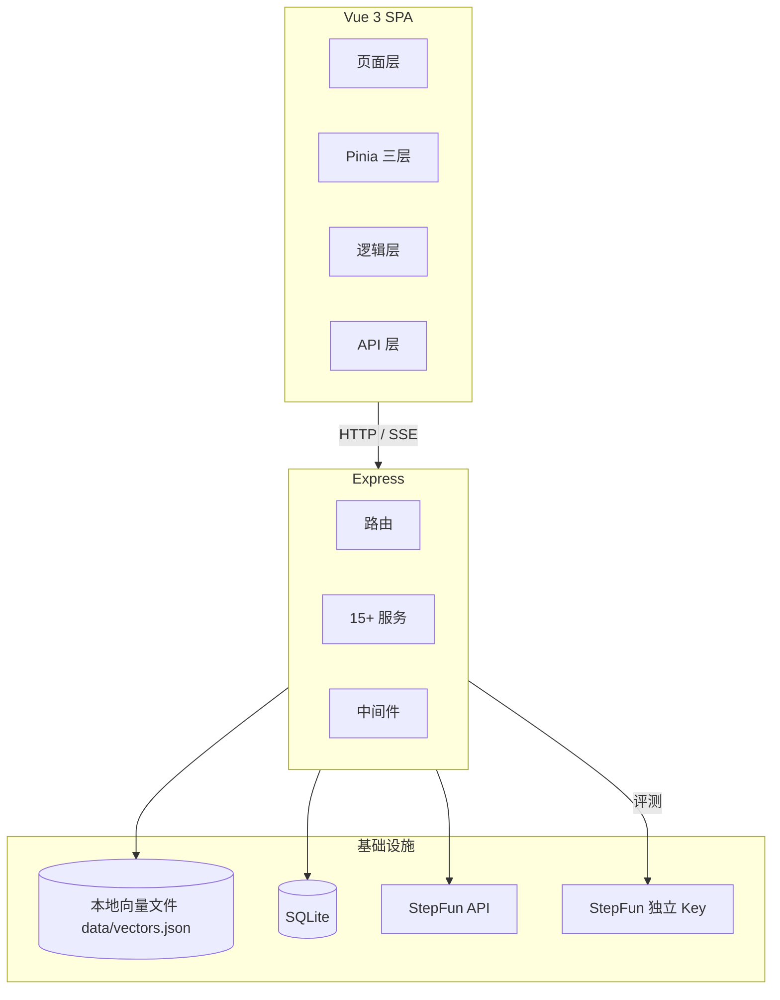

# 武理小精灵 RAG 系统 — 架构与调优记录

## 项目概述

武理小精灵是一个基于 RAG 的武汉理工大学校园知识问答系统。前端 Vue 3 + Pinia SPA，后端 Express，向量库默认 Qdrant 独立服务（2026-08-10 起，本地文件持久化版保留可切换），Embedding BGE-small-zh（本地 ONNX），Reranker BGE-reranker-base（本地 ONNX cross-encoder），LLM StepFun step-3.7-flash，评测独立使用 step-3.5-flash + 独立 API Key。

## 整体架构



## 架构

### 当前检索链路（2026-08-10）

```
用户提问
  ↓
BGE-small-zh ONNX → 稠密 512d + n-gram 稀疏向量（整数 key 哈希）
  ↓
Qdrant 独立服务检索 (topK=50)（默认 VECTOR_STORE_BACKEND=qdrant）
  融合：默认 weighted（0.6·dense + 0.4·sparse，官方评测 80.7% recall 优于 RRF 74.5%）
  RRF 可选（RAG_FUSION=rrf，k=10，score = Σ 1/(k+rank)）
  （本地文件版 vector-store.service.js 仍保留，VECTOR_STORE_BACKEND=file 可切换）
  ↓
50 句子 → 按 parentId 归并 → ~15 个父段落
  ↓
BGE-reranker-base cross-encoder 逐对打分 → sigmoid
  ↓
自适应截断（断崖>0.05 + 低分<0.3 + 硬上限=rerankTopK）
  ↓
二级排序 (docId, parentIdx)
  ↓
上下文组装 max 6000 字
  ↓
StepFun step-3.7-flash → 回复 + sources
```

### 父子段落架构

```
文档 → 章节合并(按 一、二、三 标题) → 段落(父级) → 句子(子级)
检索命中句子 → 按 parentId 去重 → BGE-reranker 排序 → 自适应截断 → LLM 上下文
```

### 状态管理架构

```
chat.store（聚合层）→ 页面统一接口
  ├─ conversation.store（会话数据：列表、缓存、后端同步）
  └─ message.store（流式过程：loading、streamingId、发送/重试/中断）
       └─ useStreaming composable（SSE 解析、RAF 合并、重连、后台 Tab 兜底）
```

### 评测体系

```
离线测试集（32 题，覆盖 6 文档）
  ├─ eval-retrieval.js → Recall/Precision/MRR/nDCG
  ├─ eval-ragas.js → LLM-as-judge（独立 Key + step-3.5-flash）
  │   └─ 失败降级 → 关键词匹配
  ├─ 人工抽检 EvalScoring.vue → 1-5 分
  └─ 线上反馈 RagFeedback.vue → like/dislike 统计
回归评估：基线比对，指标变化 > 2% 告警
```

## 涉及文件

### 前端核心
- `src/views/AIChat.vue` — 主聊天页
- `src/stores/chat.store.js` — 聚合 store
- `src/stores/conversation.store.js` — 会话数据
- `src/stores/message.store.js` — 流式状态
- `src/composables/useStreaming.js` — SSE 流式
- `src/composables/useMarkdownRenderer.js` — Markdown 渲染
- `src/api/chat.js` — 流式 API + 连接管理
- `src/components/chat/ChatBox.vue` — 输入框/语音/文件上传
- `src/components/chat/MessageList.vue` — 消息列表
- `src/components/chat/MarkdownRenderer.vue` — Markdown 组件
- `src/components/chat/VoiceRecorder.vue` — 语音输入

### 后端核心
- `indexing.service.js` — 段落→句子两层切片 + 中文章节合并
- `vector-store-qdrant.service.js` — Qdrant 独立服务（默认，dense+sparse 双查询 + 加权融合）
- `vector-store.service.js` — 本地文件持久化 + 精确相似度检索（稠密+稀疏混合，可切换）
- `embedding.service.js` — BGE-small-zh ONNX + n-gram 稀疏（整数 key）
- `reranker.service.js` — BGE-reranker-base cross-encoder
- `rag.service.js` — 检索/自适应截断/二级排序/上下文组装
- `ai.service.js` — LLM 调用 + 请求队列（LLM_CONCURRENCY=3）
- `ocr.service.js` — 视觉识别（step-1o-turbo-vision）：图片/扫描件 → Markdown，mupdf 渲染 + 页级并发，支持按页 OCR（opts.pages/returnMap，文本型 PDF 表格页重建用）
- `judge.service.js` — LLM-as-judge 独立 Key，4 指标合并 1 次请求
- `config/index.js` — 集中配置

### 评测
- `scripts/rag-eval/eval-retrieval.js` — 检索指标评测
- `scripts/rag-eval/eval-ragas.js` — RAGAS 评测
- `scripts/rag-eval/dataset/` — 5 套测试集
- `scripts/rag-eval/results/` — 评测结果

## 调优历程

### ✅ 已完成

**1. 存储层修复：Redis Cloud → MemoryStore（2025-07-13）**
- 问题：Redis Cloud 跨太平洋 hgetall 2-3s，单次 RAG 55s
- 修复：注释 REDIS_URL，使用本地 MemoryStore
- 效果：listDocuments 32s → 5ms

**2. Embedding：n-gram → BGE-small-zh ONNX（2025-07-13）**
- 问题：BGE-M3 API 失效，降级到 n-gram 哈希，无语义理解
- 修复：集成 @xenova/transformers，加载 Xenova/bge-small-zh-v1.5（24MB, 512d）

**3. 父子段落检索（2025-07-13）**
- 句子级向量化 → 段落级上下文注入
- 上下文 ~6000 字 → ~300 字（降 95%）

**4. 段落碎片化修复：章节合并（2025-07-14）**
- mammoth 提取 258 短段落 → 按中文章节标题合并 → 21 语义块
- 涉及：indexing.service.js — _mergeBySection()

**5. BGE-reranker-base 集成（2025-07-14）**
- 替换 2-gram 关键词精排为 cross-encoder 语义精排
- INT8 ONNX (~278MB)，~145ms/15 候选

**6. 稀疏向量格式修复（2025-07-14）**
- _localSparse() 输出 { "b:学校": 1 } 字符串 key → Milvus 不兼容（NaN）
- 改为哈希到整数 key：{ 123456: 1, 789012: 2 }，符合 Milvus SparseFloatVector 格式

**7. 自适应截断 + 二级排序（2025-07-14）**
- 断崖检测（分差 > 0.05 截断）+ 低分过滤（< 0.3）+ 硬上限 rerankTopK
- 二级排序 (docId, parentIdx) 让上下文按阅读顺序排列

**8. Milvus 集合加载修复（2025-07-14）**
- 创建索引后需 loadCollectionSync()，否则报 "collection not loaded"
- WeightedRanker 参数改为数组 [0.6, 0.4]

**9. LLM-as-judge 独立 Key 隔离（2025-07-24）**
- 问题：评测和生产共用 API Key，5 并发/10 RPM 互相抢占，限流导致有效样本少
- 修复：独立 JUDGE_API_KEY + JUDGE_MODEL=step-3.5-flash
- 4 指标合并到 1 次请求，128 次 → 32 次
- 失败自动降级关键词匹配

**10. 父段 MMR 去重 + 元数据过滤（2026-08-08）**
- 问题：评测显示学校概况类 pass 仅 36%，具体事实（食堂数、社团数）不在 top 5 段；rerankTopK=5 时同文档相似段落挤占上下文
- 修复 A：父段归并后 MMR 去重（`_mmrDedupe`）
  - 字符 bigram Jaccard 相似度（零模型调用），`λ·relevance − (1−λ)·maxSim(selected)` 贪心选择
  - 与已选父段相似度 ≥ 0.85 视为冗余直接剔除；RAG_MMR_ENABLED / RAG_MMR_LAMBDA / RAG_MMR_MAX_SIM
  - 接入 localSearchChat（截断后）与 assembleParentContext（流式路径）
- 修复 B：元数据过滤（Multi-faceted Filtering，`_inferDocCategory`）
  - 问题关键词命中 ≥ 2 个类别词 → 自动推断文档类别（学校概况/专业课程/面试刷题/AI学习）并作为 search filter
  - 低置信度返回 null 不设过滤（保全库召回）；自动过滤空结果时回退全库检索（防跨文档问题误伤）
  - RAG_AUTO_CATEGORY_FILTER 开关，trace 记录 autoCategory / filterFallback
- ⚠️ 回归（2026-08-09 官方评测）：MMR 去重导致跨文档 recall 显著下降
  - full-coverage 32 题同链路对比：加权+MMR默认 **Recall 80.7%**；关闭 MMR 后 **97.4%**（历史基线 99.0%，基线评测时无 MMR）
  - 根因：doc_9a78 与 doc_4dcd 父段 bigram Jaccard 相似度 = 1.0（内容几乎相同），`相似度≥0.85 直接剔除` 把**第二个相关文档整体剔掉**（C01-C08 全部只命中 1 个相关 doc、漏 doc_9a78）
- ✅ 修复（2026-08-09）：相似度剔除仅限**同 docId 内**父段，跨文档高度相似不再剔除（`_mmrDedupe` 中 maxSim 只统计 docId 相同的已选父段）
  - 保留原设计目标：解决"同文档相似段落挤占上下文"；同时保住多文档问题的第二个相关文档
  - 修复后官方评测（加权+新 MMR）：**Recall 97.4%**、MRR 0.977、nDCG@5 0.970、HitRate 100%
  - 学校概况类 48.5% → **97.0%**；C01-C08 全部 100% 命中（不再漏 doc_9a78）
  - 测试：rag.mmr-category.test.js 新增"跨文档高度相似不剔除"用例，后端全量 131 用例通过

**11. 混合检索融合：加权打分 → RRF → 回退加权（2026-08-09）**
- 问题：稠密 cosine 与稀疏 cosine 量纲/分布不可比，0.6/0.4 加权需要反复校准，项目此前为此加了 `_terminality` 动态调权补丁
- 尝试 A：`vector-store.service.js` search() 改为 RRF（Reciprocal Rank Fusion）
  - 稠密/稀疏两通道各自按分数独立排名，`score = Σ 1/(k + rank)`，k 默认 60（RAG_RRF_K 可调）
  - 0 分视为该通道未命中不参与排名；trace 保留 _vectorScore/_sparseScore/_retrievalChannels
  - 同步清理：删除 `_terminality` 动态权重路由与 rag.vectorWeight/keywordWeight 配置；`fuseRetrievalResults` 一并改纯 RRF
- 实测（2026-08-09，full-coverage-qa.json 32 题，同链路同数据集，测试账号跑官方评测）：

  | 指标 | RRF(k=60) | 加权(0.6/0.4) |
  |------|:---:|:---:|
  | Recall | 74.5% | **80.7%** |
  | MRR | 0.914 | **0.977** |
  | nDCG@5 | 0.777 | **0.840** |
  | HitRate | 93.8% | **100.0%** |
  | 按类别 recall | 学校概况 48.5% / 专业课程 86.4% / 面试刷题 80% / AI学习 100% | 学校概况 48.5% / 专业课程 **95.5%** / 面试刷题 **100%** / AI学习 100% |

  结论：**加权全面优于 RRF**（专业课程、面试刷题类提升最明显）。离线融合层 A/B 曾显示两者几乎持平（Recall@5 96.9% vs 100%），但官方全链路评测（含 reranker）拉开差距——RRF 稀疏通道的噪声排名干扰了后续 rerank。
- 🔬 k 值影响复测（2026-08-09，`offline-rrf-ab.cjs 10 20 40 60` 离线融合层 + 官方评测）：

  | 融合方式 | 离线 Recall@5 | 离线 MRR | 离线 nDCG@5 | 官方 Recall | 官方 MRR | 官方 nDCG@5 |
  |------|:---:|:---:|:---:|:---:|:---:|:---:|
  | 加权(0.6/0.4) | 100.0% | 0.964 | 0.967 | 97.4% | 0.977 | 0.970 |
  | RRF(k=10) | 100.0% | **0.979** | **0.981** | 97.4% | **0.984** | **0.974** |
  | RRF(k=20) | 100.0% | 0.977 | 0.978 | — | — | — |
  | RRF(k=40) | 100.0% | 0.975 | 0.975 | — | — | — |
  | RRF(k=60) | 96.9% | 0.974 | 0.963 | 74.5%* | 0.914* | 0.777* |

  \* 官方 RRF(k=60) 为 MMR 回归修复前跑的数据（当时含 MMR 跨文档剔除回归），与其它行不完全同链路。
  - 结论修正：**RRF 表现差主要是 k=60 偏大**（排名差异被过度压扁，CT05 掉出 top5）；k=10 的 RRF 与加权打平（官方 Recall 同为 97.4%，MRR/nDCG@5 微弱领先 0.007/0.004，属噪声级差异）
  - 维持默认 weighted：效果相同但零超参、更简单；RRF 保留 `RAG_FUSION=rrf` + `RAG_RRF_K=10` 作为备选
- 回退：默认融合方式改回 weighted（`config.vectorStore.fusion`，`RAG_FUSION` 环境变量可切 `weighted`/`rrf`），RRF 代码与测试保留（`backend/__tests__/rag.weights.test.js`），便于后续复现
- ⚠️ 排坑：RRF 排名必须按**句子唯一 id**（chunk id）计 rank，不能按 docId——同一 doc 的多条句子会相互覆盖，导致 RRF 被严重低估（曾出现 recall 100%→53% 的假象）

**12. 前端性能指标埋点 + 简历数据实测（2026-08-12）**
- 为简历补充前端性能数据，新增两处统计埋点（均走真实代码路径）：
  - `useMarkdownRenderer.js`：渲染缓存命中率统计（hit/miss 计数 + localStorage 持久化 `markdown_cache_stats` + 每 50 次渲染输出 `[MarkdownCache]` 日志）
  - `VoiceRecorder.vue`：识别成功率统计（会话级：产出 final 转写 → success；onerror 除 aborted 外 → fail；localStorage `voice_recognition_stats` + `[VoiceStats]` 日志）
- 命中率实测（vitest 模拟典型聊天场景，走真实 `renderMarkdownMain`，3 场景各渲染 100 次）：
  - 流式为主场景：原始命中率 22%（流式 chunk 内容实时变化天然 miss），**重复渲染命中率 95.7%**
  - 历史回看/虚拟滚动 remount：95.0%；同一内容反复渲染：99.0%
  - ⚠️ 口径：简历写"重复渲染命中率 95%+"即可，不能写总命中率（含流式增量仅 22%）
- SSE 首包响应实测（生产环境 `measure-rag-stream.cjs`，4 轮）：
  - HTTP 建连 ~67-88ms；retrieval 事件（SSE 首包）典型 **115-131ms**（一轮异常 432ms）；首个 content（首 token，含 LLM 思考）5.9-7.6s
  - ⚠️ 口径：简历写"SSE 首包 ~130ms（<150ms）"；前端 `chat.js` 的 TTFT 埋点测的是首个 content（≈6s），两者不可混用
- 测试：`src/__tests__/markdownCacheHitRate.test.js`（3 场景命中率）、`src/__tests__/voiceRecorderStats.test.js`（成功率 + localStorage 持久化，假 recognition 模拟）

**13. 扫描件 OCR + 图片表格识别（2026-08-12）**
- 问题：① pdf-parse 对扫描件 PDF 提不出文本（无文本层），上传直接报"文件内容为空"；② 聊天图片上传只存 URL 不解析，图片（含表格截图）进不了 RAG 链路
- 方案：新增 `ocr.service.js`，走 StepFun `step-1o-turbo-vision`（OpenAI 兼容 `image_url` + `detail` 参数，零新依赖，复用 AI_API_KEY）
  - `recognizeImage(buffer, mime)`：图片 → 结构化 Markdown（prompt 强制表格转 Markdown 表格语法，保留行列结构）
  - `ocrPdf(filePath)`：mupdf 逐页渲染 PNG（`Matrix.scale(2,2)` + DeviceRGB）→ 页级并发（默认 2）逐页识别 → 按"第 N 页"合并
- 接入：`file-upload.service.js` `parsePDF` 先 pdf-parse 文本层，提取 < `OCR_PDF_MIN_CHARS`(30) 字判定扫描件 → 自动降级 OCR；`parseFile` 新增图片分支；`register.js` 聊天上传图片也走识别，失败降级 null 不阻塞上传
- 成本闸门：`detail=low` 每图约 169 token（表格场景可切 high）、`OCR_MAX_PAGES`(30) 页数封顶、`OCR_ENABLED` 总开关，关闭时退回原行为
- ⚠️ 排坑：vitest 4 中 `vi.mock` 对 CJS `require` 链不生效（ESM import 生效、CJS require 不生效），测试改 `vi.stubEnv` + `delete require.cache` + 动态 import 重建服务实例；mupdf 1.28 为 ESM-only，CJS 中用动态 `import('mupdf')` 懒加载
- 测试：`backend/__tests__/ocr.service.test.js`（4 用例：未启用/无 Key 降级、detail 默认与覆盖）；后端全量 135 用例通过

**14. 文本型 PDF 表格页检测 + 按页 OCR 重建（2026-08-13）**
- 问题：pdf-parse 对表格只输出纯文本流，**行列结构丢失**（表格截图/扫描件已由视觉模型保留 Markdown 表格，文本型 PDF 是唯一缺口）。此前认知是"需引入专用表格结构识别模型（Table Transformer）"，实际**复用已有视觉模型即可**——缺的不是识别能力，而是"哪些页有表格"的廉价检测器
- 方案 A（落地）：文本层启发式检测表格页 → 命中页按页渲染走 `step-1o-turbo-vision` 重建 Markdown 表格
  - `ocrPdf` 扩展：支持 `opts.pages`（0-based 页索引数组，越界忽略/去重/升序）与 `opts.returnMap`（返回 `[{pageIndex, text}]` 便于按页替换）；默认仍全页识别，向后兼容
  - 新增纯函数（`file-upload.service.js`，零 API 成本）：`detectTablePages(text)` 按 `\f` 分页后逐页判断；`isTableLikePage` 四个启发式信号——① `|` 竖线密度 ≥3 行 ② ASCII 分隔符行（`----`/`+---+`/`====`）≥2 ③ 列对齐（同一字段数 ≥4 行且多字段行 ≥5）④ 表头关键词（序号/名称/数量…）+ 多字段行 ≥2；`replaceTablePages` 将 OCR 结果按页替换回原文（页间以 `\f` 分隔）
  - 接入：`parsePDF` 第三步——检测命中页 → `ocrPdf(filePath, { pages, returnMap: true })` → 整页替换（视觉模型输出含整页 Markdown）；**失败/关闭回退原文，不阻塞入库**；无分页符（`\f` 缺失）时不做按页 OCR，避免整本误伤
- 成本：仅命中页 × ~169 token/页（detail=low），复用 `OCR_MAX_PAGES`/`OCR_CONCURRENCY` 闸门；`OCR_TABLE_ENABLED`（默认 true）总开关，false 时退回原行为
- 测试：`backend/__tests__/table-detect.test.js`（12 用例：三信号检测/纯文本不误报/按页替换/越界忽略/配置开关）；后端全量 **147** 用例通过

### ❌ 尝试但退回

**BM25 Function（2025-07-14）**
- Milvus 2.4 支持 BM25 Function（text → sparse_vector 自动生成）
- 但 @zilliz/milvus2-sdk-node@3.0.3 在 insert 时总把 schema 所有字段发到 protobuf
- BM25 Function 要求输出字段完全省略才触发自动计算，传空对象 {} 也不行
- 最终存进去的 sparse_vector 全为空，搜索无结果
- 等 SDK 升级后可重试

## 文档清洗（Document Cleaning）设计要点

### 为什么清洗重要（痛点）

| 痛点 | 具体危害 |
|---|---|
| 页眉页脚残留 | 每块切片都附带"第X页/共Y页"或内部编号：① 重复文本把**所有切片的相似度同量抬升**，检索区分度下降，reranker 与 MMR 更难拉开差距；② 重复内容白白**占用上下文 Token 预算**（上限 6000 字）。 |
| 软回车 / 断行 | PDF 转换常把句子拦腰截断（如"重\r\n要"）。中文无空格分词，破坏 token 边界比英文更致命，导致语义断裂、检索命中率下降。 |
| 乱码 | 两类：① **OCR 识别错误**——字符替换、方块□；② **编码错乱**——GBK/UTF-8 互读的"锟斤拷"、� 替换符。都污染 Embedding 输入，处理手段不同（ftfy 只对②有效）。 |

### Pipeline：三步走（顺序固定、不可颠倒）

**第一步 字符级修复（"去脏"）**
- 编码归一化：全角→半角**仅限英文字母/数字/英文标点**（Ａ→A）；⚠️ 中文标点（，。！？）保留全角，误转会破坏 embedding 一致性。空白统一：`\u00A0`、`\u3000`（全角空格）、`\t`、`\u200b`（零宽空格）→ 普通空格；清 BOM `\ufeff`。
- 移除控制字符：剔除 `[\x00-\x1f\x7f]`（保留 `\n`/`\r`）。
- 乱码过滤：编码错乱用 `ftfy`；OCR 错字（连续 ? / 方块□）用 `[UNK]` 占位替换 + **告警**提示 OCR 质量差。

**第二步 结构消歧（"去干扰"）— 必须先于断行合并**
- 页眉页脚清除：① 规则法——正则匹配"第X页/共Y页"、"- X -"、"Copyright ©"删整行；② 位置法——pdfplumber 读字符坐标，页面顶部/底部 2cm 内且字体明显小于正文的字符整体丢弃。
- 换行符修复：`\r\n` → `\n`；断行合并——当前行不以 `。？！：；` 结尾、且下一行不以列表序号（`1.`、`一、`、`-`）开头 → 判定硬断行，`\n` 换空格拼接。
- ⚠️ 中文特殊性：无大小写概念，断行判断不能依赖"下一行大写开头"，只能靠结尾标点 + 列表序号。

**第三步 保留 Markdown 结构（"存结构"）— 给切片器提供划分依据**
- 标题识别：按字体大小/加粗——字体 > 正文 1.5 倍标 `#`，次级 `##`（配合 `indexing.service.js` 章节合并）。
- 加粗/斜体：`<b>` → `**粗体**`、`<i>` → `*斜体*`。
- 表格转 GFM：`| 列1 | 列2 |` 格式，逐行呈现便于切片时保持行列对齐（与 `ocr.service.js` 视觉模型表格输出一致）。

### 坑与最佳实践

| 坑 | 正确做法 |
|---|---|
| 顺序颠倒 | 先合并换行、后删页眉会把两者拼一起删不干净。**先删页眉页脚，再做断行合并**。 |
| 过度清洗 | 代码块不能移除 `\n`/缩进。路由依据不只是扩展名（.py/.java），还应识别文档内**代码围栏（```）**整体跳过合并。 |
| 超长单行 | 超长 URL/Base64 不会让 embedding 报错（模型**静默截断**），但会撑爆 chunk、整块语义被从中切掉。设单行上限（如 2000 字符）强制 `\n` 截断，**保前缀、丢尾部**。 |

补充最佳实践：① 清洗结果可度量——统计 `[UNK]` 占比/乱码行占比/页眉页脚命中数，超阈值拒绝入库或人工复核；② **清洗只做一遍、入库前完成**，检索/生成阶段不再动文本，保证 embedding 与进上下文的文本一致（否则 rerank 分数失真）；③ 去重也是清洗的一部分——版权声明/免责声明等重复块，清洗 + MMR 语义去重配合。

## 评测结果

### 旧数据集（campus-qa.json，32 题，仅覆盖 1 个文档）⚠️ 已废弃
旧数据 Recall 100% 是系统性偏差——32 题全部标同一个 relevant_doc_id，等于没测。

### 新数据集（full-coverage-qa.json，32 题，覆盖 6 个文档）
2025-07-15 创建，文档分布：校园手册 ×11、软件工程 ×5、离散数学 ×6、CodeTop ×7、Agent笔记 ×5、跨文档推理 ×4。

#### 检索指标（doc 级别，依赖 relevant_doc_ids 标注）

```
文档命中率    100.0%  (32/32)
Recall         99.0%
Precision      67.2%
MRR             0.969
nDCG@5          0.972
```

按文档召回均为 100%。唯一丢分是 XD04（跨 3 文档，只命中 2 个）。

#### 规则生成评测（规则 Pass/Fail，不依赖 LLM judge）

| 配置 | Pass | 拒绝 |
|------|:----:|:----:|
| **rerankTopK=5** | **17/32 (53.1%)** | 15/32 |
| rerankTopK=10 | 16/32 (50.0%) | 16/32 |

按分类（rerankTopK=5）：
- 学校概况: 4/11 pass (36%) — 最弱，具体事实（食堂数、社团数）不在 top 5 段
- 专业课程: 7/11 pass (64%) — 离散数学全过，软件工程选择题半数拒
- 面试刷题: 3/5 pass (60%) — 算法题能答，元信息题拒
- AI学习: 3/5 pass (60%)

主要拒答原因：**RAG_VECTOR_TOP_K=50 句子候选池不够宽**，答案所在句子命中概率不足。增大 topK 后 reranker 从更大池子精筛有望提升。

## 环境配置

```env
# LLM 生产
AI_API_KEY=...
AI_BASE_URL=https://api.stepfun.com/step_plan/v1
AI_MODEL=step-3.7-flash
LLM_CONCURRENCY=3

# LLM 评测（独立 Key，不抢生产配额）
JUDGE_API_KEY=...
JUDGE_MODEL=step-3.5-flash

# 向量库（2026-08-10 起默认 Qdrant 独立服务；文件持久化版保留可切换）
VECTOR_STORE_BACKEND=qdrant
QDRANT_URL=http://localhost:6333
# 混合检索融合：weighted（默认，0.6/0.4 加权打分）| rrf（可选，RAG_FUSION=rrf 切换）
# 2026-08-09 实测：k=10 的 RRF 与加权打平（Recall 均 97.4%，MRR/nDCG 微弱领先），k=60 明显偏大
RAG_FUSION=weighted
RAG_RRF_K=10
# 以下权重供加权融合与 Qdrant 后端使用
MILVUS_DENSE_WEIGHT=0.6
MILVUS_SPARSE_WEIGHT=0.4

# RAG 参数
RAG_VECTOR_TOP_K=50
RAG_RERANK_TOP_K=10
RAG_MAX_CONTEXT_LENGTH=6000

# OCR / 视觉识别（扫描件 PDF 与图片表格，走 step-1o-turbo-vision，复用 AI_API_KEY）
OCR_ENABLED=true
OCR_MODEL=step-1o-turbo-vision
OCR_DETAIL=low          # low≈169 token/图；表格细节切 high（按图大小计费）
OCR_MAX_PAGES=30        # 扫描 PDF 识别页数上限（成本闸门）
OCR_CONCURRENCY=2       # 页级识别并发上限
OCR_PDF_MIN_CHARS=30    # pdf-parse 提取文本低于该阈值判定扫描件 → OCR 兜底
OCR_TABLE_ENABLED=true  # 文本型 PDF 表格页检测 + 按页 OCR 重建 Markdown 表格（复用视觉模型，仅命中页计费）
```

## 评估脚本

```bash
cd scripts/rag-eval

# 检索评测（需设置 RAG_EVAL_COOKIE）
RAG_EVAL_COOKIE="auth_token=..." node eval-retrieval.js

# 新数据集检索/规则评测
# ⚠️ 用 DATASET_PATH 环境变量指定数据集；runRetrievalEval 的 datasetPath 参数不生效（脚本只读 DATASET_PATH）
DATASET_PATH=dataset/full-coverage-qa.json RAG_EVAL_COOKIE="auth_token=..." node eval-retrieval.js
```

评测数据：
- `dataset/full-coverage-qa.json` — 32 题，覆盖 6 文档（当前主要评测集）
- `dataset/campus-qa.json` — 32 题，仅 1 文档（已废弃）
- `dataset/hardcases-qa.json` — 16 题高难度（跨文档推理，设定了 relevant_doc_ids）