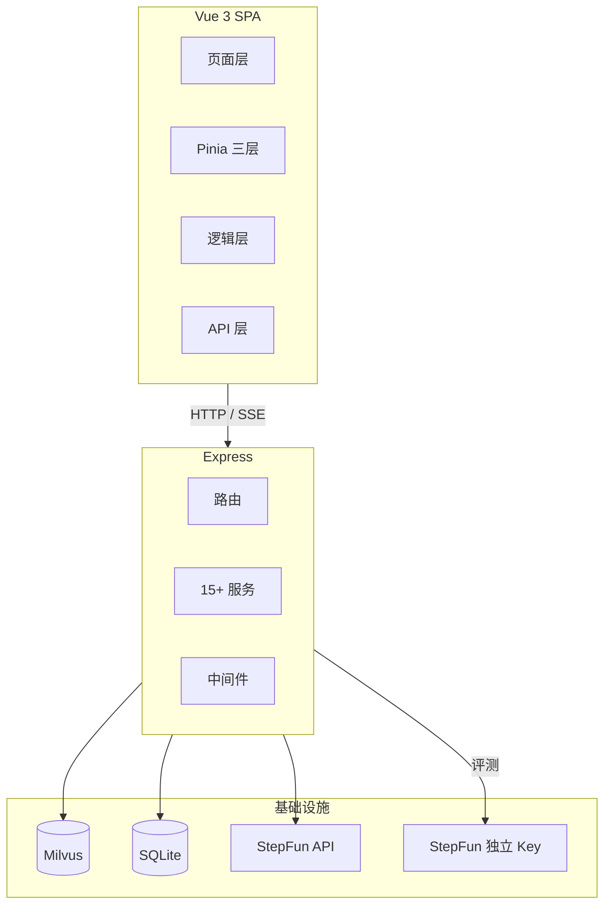

# 武理小精灵 RAG 系统 — 架构与调优记录

## 项目概述

武理小精灵是一个基于 RAG 的武汉理工大学校园知识问答系统。前端 Vue 3 + Pinia SPA，后端 Express，向量库 Milvus 2.4.17 Standalone（Docker），Embedding BGE-small-zh（本地 ONNX），Reranker BGE-reranker-base（本地 ONNX cross-encoder），LLM StepFun step-3.7-flash，评测独立使用 step-3.5-flash + 独立 API Key。

## 整体架构



## 架构

### 当前检索链路（2025-07-15）

```
用户提问
  ↓
BGE-small-zh ONNX → 稠密 512d + n-gram 稀疏向量（整数 key 哈希）
  ↓
Milvus Hybrid Search (topK=50)
  稠密 COSINE ×0.6 + 稀疏 IP ×0.4
  ↓
50 句子 → 按 parentId 归并 → ~15 个父段落
  ↓
BGE-reranker-base cross-encoder 逐对打分 → sigmoid
  ↓
自适应截断（断崖>0.05 + 低分<0.3 + 硬上限=rerankTopK）
  ↓
二级排序 (docId, parentIdx)
  ↓
上下文组装 max 6000 字
  ↓
StepFun step-3.7-flash → 回复 + sources
```

### 父子段落架构

```
文档 → 章节合并(按 一、二、三 标题) → 段落(父级) → 句子(子级)
检索命中句子 → 按 parentId 去重 → BGE-reranker 排序 → 自适应截断 → LLM 上下文
```

### 状态管理架构

```
chat.store（聚合层）→ 页面统一接口
  ├─ conversation.store（会话数据：列表、缓存、后端同步）
  └─ message.store（流式过程：loading、streamingId、发送/重试/中断）
       └─ useStreaming composable（SSE 解析、RAF 合并、重连、后台 Tab 兜底）
```

### 评测体系

```
离线测试集（32 题，覆盖 6 文档）
  ├─ eval-retrieval.js → Recall/Precision/MRR/nDCG
  ├─ eval-ragas.js → LLM-as-judge（独立 Key + step-3.5-flash）
  │   └─ 失败降级 → 关键词匹配
  ├─ 人工抽检 EvalScoring.vue → 1-5 分
  └─ 线上反馈 RagFeedback.vue → like/dislike 统计
回归评估：基线比对，指标变化 > 2% 告警
```

## 涉及文件

### 前端核心
- `src/views/AIChat.vue` — 主聊天页
- `src/stores/chat.store.js` — 聚合 store
- `src/stores/conversation.store.js` — 会话数据
- `src/stores/message.store.js` — 流式状态
- `src/composables/useStreaming.js` — SSE 流式
- `src/composables/useMarkdownRenderer.js` — Markdown 渲染
- `src/api/chat.js` — 流式 API + 连接管理
- `src/components/chat/ChatBox.vue` — 输入框/语音/文件上传
- `src/components/chat/MessageList.vue` — 消息列表
- `src/components/chat/MarkdownRenderer.vue` — Markdown 组件
- `src/components/chat/VoiceRecorder.vue` — 语音输入

### 后端核心
- `indexing.service.js` — 段落→句子两层切片 + 中文章节合并
- `vector-store.service.js` — Milvus schema/hybrid search/insert/BM25 Function 尝试
- `embedding.service.js` — BGE-small-zh ONNX + n-gram 稀疏（整数 key）
- `reranker.service.js` — BGE-reranker-base cross-encoder
- `rag.service.js` — 检索/自适应截断/二级排序/上下文组装
- `ai.service.js` — LLM 调用 + 请求队列（LLM_CONCURRENCY=3）
- `judge.service.js` — LLM-as-judge 独立 Key，4 指标合并 1 次请求
- `config/index.js` — 集中配置

### 评测
- `scripts/rag-eval/eval-retrieval.js` — 检索指标评测
- `scripts/rag-eval/eval-ragas.js` — RAGAS 评测
- `scripts/rag-eval/dataset/` — 5 套测试集
- `scripts/rag-eval/results/` — 评测结果

## 调优历程

### ✅ 已完成

**1. 存储层修复：Redis Cloud → MemoryStore（2025-07-13）**
- 问题：Redis Cloud 跨太平洋 hgetall 2-3s，单次 RAG 55s
- 修复：注释 REDIS_URL，使用本地 MemoryStore
- 效果：listDocuments 32s → 5ms

**2. Embedding：n-gram → BGE-small-zh ONNX（2025-07-13）**
- 问题：BGE-M3 API 失效，降级到 n-gram 哈希，无语义理解
- 修复：集成 @xenova/transformers，加载 Xenova/bge-small-zh-v1.5（24MB, 512d）

**3. 父子段落检索（2025-07-13）**
- 句子级向量化 → 段落级上下文注入
- 上下文 ~6000 字 → ~300 字（降 95%）

**4. 段落碎片化修复：章节合并（2025-07-14）**
- mammoth 提取 258 短段落 → 按中文章节标题合并 → 21 语义块
- 涉及：indexing.service.js — _mergeBySection()

**5. BGE-reranker-base 集成（2025-07-14）**
- 替换 2-gram 关键词精排为 cross-encoder 语义精排
- INT8 ONNX (~278MB)，~145ms/15 候选

**6. 稀疏向量格式修复（2025-07-14）**
- _localSparse() 输出 { "b:学校": 1 } 字符串 key → Milvus 不兼容（NaN）
- 改为哈希到整数 key：{ 123456: 1, 789012: 2 }，符合 Milvus SparseFloatVector 格式

**7. 自适应截断 + 二级排序（2025-07-14）**
- 断崖检测（分差 > 0.05 截断）+ 低分过滤（< 0.3）+ 硬上限 rerankTopK
- 二级排序 (docId, parentIdx) 让上下文按阅读顺序排列

**8. Milvus 集合加载修复（2025-07-14）**
- 创建索引后需 loadCollectionSync()，否则报 "collection not loaded"
- WeightedRanker 参数改为数组 [0.6, 0.4]

**9. LLM-as-judge 独立 Key 隔离（2025-07-24）**
- 问题：评测和生产共用 API Key，5 并发/10 RPM 互相抢占，限流导致有效样本少
- 修复：独立 JUDGE_API_KEY + JUDGE_MODEL=step-3.5-flash
- 4 指标合并到 1 次请求，128 次 → 32 次
- 失败自动降级关键词匹配

### ❌ 尝试但退回

**BM25 Function（2025-07-14）**
- Milvus 2.4 支持 BM25 Function（text → sparse_vector 自动生成）
- 但 @zilliz/milvus2-sdk-node@3.0.3 在 insert 时总把 schema 所有字段发到 protobuf
- BM25 Function 要求输出字段完全省略才触发自动计算，传空对象 {} 也不行
- 最终存进去的 sparse_vector 全为空，搜索无结果
- 等 SDK 升级后可重试

## 评测结果

### 旧数据集（campus-qa.json，32 题，仅覆盖 1 个文档）⚠️ 已废弃
旧数据 Recall 100% 是系统性偏差——32 题全部标同一个 relevant_doc_id，等于没测。

### 新数据集（full-coverage-qa.json，32 题，覆盖 6 个文档）
2025-07-15 创建，文档分布：校园手册 ×11、软件工程 ×5、离散数学 ×6、CodeTop ×7、Agent笔记 ×5、跨文档推理 ×4。

#### 检索指标（doc 级别，依赖 relevant_doc_ids 标注）

```
文档命中率    100.0%  (32/32)
Recall         99.0%
Precision      67.2%
MRR             0.969
nDCG@5          0.972
```

按文档召回均为 100%。唯一丢分是 XD04（跨 3 文档，只命中 2 个）。

#### 规则生成评测（规则 Pass/Fail，不依赖 LLM judge）

| 配置 | Pass | 拒绝 |
|------|:----:|:----:|
| **rerankTopK=5** | **17/32 (53.1%)** | 15/32 |
| rerankTopK=10 | 16/32 (50.0%) | 16/32 |

按分类（rerankTopK=5）：
- 学校概况: 4/11 pass (36%) — 最弱，具体事实（食堂数、社团数）不在 top 5 段
- 专业课程: 7/11 pass (64%) — 离散数学全过，软件工程选择题半数拒
- 面试刷题: 3/5 pass (60%) — 算法题能答，元信息题拒
- AI学习: 3/5 pass (60%)

主要拒答原因：**RAG_VECTOR_TOP_K=50 句子候选池不够宽**，答案所在句子命中概率不足。增大 topK 后 reranker 从更大池子精筛有望提升。

## 环境配置

```env
# LLM 生产
AI_API_KEY=...
AI_BASE_URL=https://api.stepfun.com/step_plan/v1
AI_MODEL=step-3.7-flash
LLM_CONCURRENCY=3

# LLM 评测（独立 Key，不抢生产配额）
JUDGE_API_KEY=...
JUDGE_MODEL=step-3.5-flash

# 向量库
VECTOR_STORE_BACKEND=milvus
MILVUS_ADDRESS=localhost:19530
MILVUS_COLLECTION=wuli_elf_chunks
MILVUS_DENSE_WEIGHT=0.6
MILVUS_SPARSE_WEIGHT=0.4

# RAG 参数
RAG_VECTOR_TOP_K=50
RAG_RERANK_TOP_K=10
RAG_MAX_CONTEXT_LENGTH=6000
```

## 评估脚本

```bash
cd scripts/rag-eval

# 检索评测（需设置 RAG_EVAL_COOKIE）
RAG_EVAL_COOKIE="auth_token=..." node eval-retrieval.js

# 新数据集检索/规则评测
RAG_EVAL_COOKIE="auth_token=..." node -e "
  import {runRetrievalEval} from './eval-retrieval.js';
  runRetrievalEval({datasetPath:'dataset/full-coverage-qa.json'});
"
```

评测数据：
- `dataset/full-coverage-qa.json` — 32 题，覆盖 6 文档（当前主要评测集）
- `dataset/campus-qa.json` — 32 题，仅 1 文档（已废弃）
- `dataset/hardcases-qa.json` — 16 题高难度（跨文档推理，设定了 relevant_doc_ids）