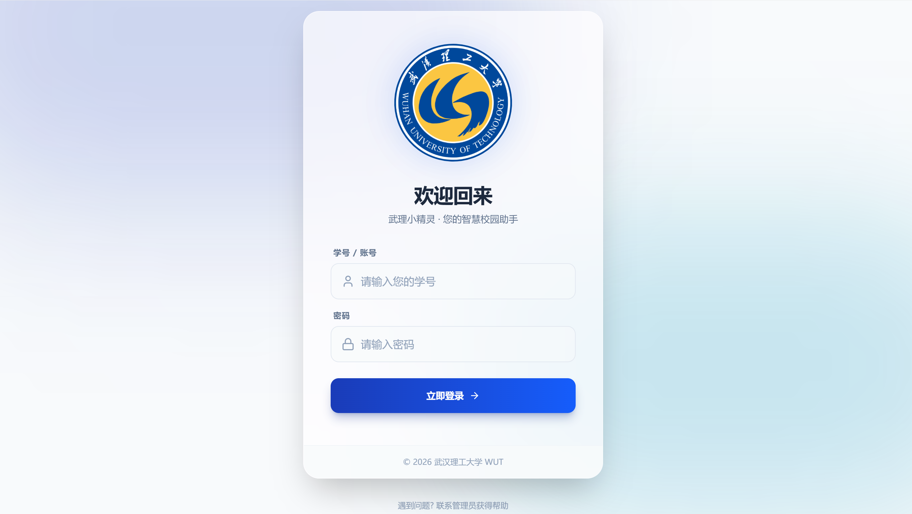

# 武理小精灵 / Wuli Little Genie

  

简短描述：武理小精灵是一个基于 Vue 3 + Pinia 的前端界面与 Node/Express 后端的 AI 聊天演示应用，使用讯飞/本地 Qwen 栈或模拟模式提供聊天能力。

Brief description: Wuli Little Genie is a demo AI chat application with a Vue 3 + Pinia frontend and a Node/Express backend. It supports iFlyTek/Qwen integration or a local mock mode for development.

## 目录 / Table of Contents
- 功能特性 / Features
- 演示 / Demo & Screenshots
- 快速开始 / Quick Start
- 安装 / Installation
- 使用方法 / Usage
- 配置 / Configuration
- 项目结构 / Project Structure
- 贡献 / Contributing
- 许可证 / License
- 致谢 / Acknowledgments

---

**✨ 功能特性 / ✨ Features**

- 聊天界面：基于 Vue 3 + Composition API 的即时聊天 UI（`src/views/AIChat.vue`）。
- 打字机流式渲染：模拟流式输出的打字机效果，增进用户体验（`src/stores/chat.store.ts`）。
- 代码高亮与复制：支持 Markdown 渲染、代码高亮（highlight.js）与一键复制代码块功能（复制按钮在消息右上角）。
- 前后端分离：前端通过 `/api` 调用后端 Express 服务（`backend/src/app.ts`），后端封装了 AI 服务适配层（`backend/src/services/chat.service.ts`）。
- 模拟与真实模式：若未配置讯飞 API Key，后端会以模拟模式返回演示文本，便于本地开发和离线测试（参见 `backend/src/config`）。

**🖼️ 演示 / Screenshots**

- 主界面截图：

---

## 🚀 快速开始 / Quick Start

前提条件 / Prerequisites

- Node.js >= 18
- npm 或 pnpm

启动前端（在项目根）

```bash
npm install
npm run dev
```

启动后端（在 `backend/` 目录）

```bash
cd backend
npm install
npm run dev
```

如果你想在同一台机器上开发，确保 `vite.config.ts` 中的代理或 CORS 配置允许前端连接到 `http://localhost:3000`（后端默认端口）。

---

## 📦 安装 / Installation

1. 克隆仓库

```bash
git clone https://github.com/你的用户名/项目名称.git
cd 项目名称
```

2. 安装前端依赖并运行

```bash
npm install
npm run dev
```

3. 安装并运行后端

```bash
cd backend
npm install
npm run dev
```

4. 配置环境变量

复制示例并编辑 `.env`（或 `.env.local`）

```bash
cp backend/.env.example backend/.env
# 编辑 backend/.env, 填入 Xunfei / Qwen 相关配置（若使用真实 AI 服务）
```

---

## 📖 使用方法 / Usage

前端会调用 `src/api/chat.ts` 中的 `sendMessageToBackend(message, history)`，该函数会 POST 到 `/api` 并读取 `data.data.reply` 作为回复文本。后端在 `backend/src/app.ts` 中接收请求并调用 `ChatService` 返回结构 `{ success: true, data: { reply } }`。

示例：在 UI 中输入问题并回车或点击发送按钮，消息会显示在对话中并触发后端请求。

---

## ⚙️ 配置 / Configuration

重要环境变量（示例）

| 环境变量 | 默认值 | 描述 |
|---|---:|---|
| XUNFEI_API_KEY | (无) | 讯飞 / Qwen 服务的 API Key |
| PORT | 3000 | 后端监听端口 |

后端配置位于 `backend/src/config/index.ts`（或 `backend/.env.example`）。

---

## 📁 项目结构 / Project Structure

```
项目根目录/
├── backend/                # Express 后端代码
│   ├── src/
│   │   ├── services/       # AI 服务适配实现（chat.service.ts, xunfei.service.ts）
│   │   ├── routes/         # 路由
│   │   └── app.ts          # Express 启动与路由挂载
│   └── package.json
├── public/                 # 静态资源
├── src/                    # 前端源代码 (Vue 3 + Pinia)
│   ├── views/
│   │   └── AIChat.vue      # 聊天主界面
│   ├── stores/             # Pinia store（chat.store.ts）
│   ├── api/                # 前端请求封装（chat.ts）
│   └── main.ts
├── package.json            # 前端依赖与脚本
├── vite.config.ts          # Vite 配置（含 dev proxy）
└── README.md
```

---

## 🤝 贡献 / Contributing

欢迎贡献！流程：

1. Fork 本仓库
2. 新建分支：`git checkout -b feature/YourFeature`
3. 提交并推送：`git commit -m "feat: 描述你的改动" && git push origin feature/YourFeature`
4. 提交 PR 并在描述中说明改动与测试方式

请遵循现有代码风格（TypeScript + Vue Composition API）并添加必要的描述与变更说明。

---

## 📄 许可证 / License

本项目使用 MIT 许可证 — 详见 `LICENSE` 文件。

---

## 🙏 致谢 / Acknowledgments

- 感谢讯飞/Qwen 提供的模型接口参考。
- 感谢使用的开源库：Vue 3、Pinia、Vite、highlight.js 等。

---

## 联系方式 / Contact

- 项目链接：https://github.com/L123121/Vue3_WUT_LLM
- 问题反馈：请通过 GitHub Issues 提交
