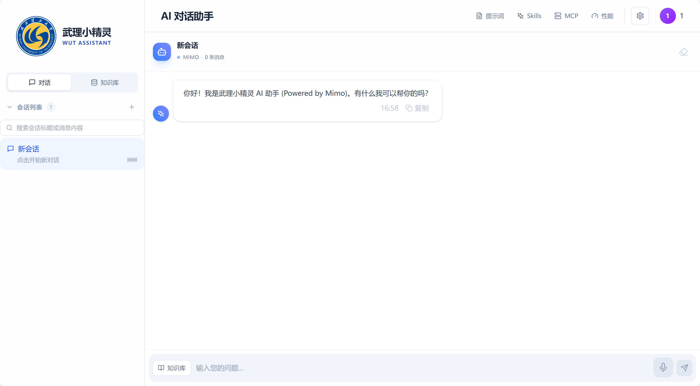

# WUT RAG Copilot / 武理 RAG 助手

    

基于 RAG 知识库增强的武理校园 AI 助手，支持文档向量化检索、多会话管理、流式输出、GitHub Skills 导入，使用讯飞星火大模型提供智能对话能力。

A RAG-enhanced AI copilot for WUT campus, featuring document vectorized retrieval, multi-conversation management, streaming output, GitHub Skills import, and powered by iFlyTek Spark LLM.

## 目录 / Table of Contents
- [功能特性 / Features](#功能特性--features)
- [演示 / Demo & Screenshots](#演示--screenshots)
- [快速开始 / Quick Start](#快速开始--quick-start)
- [安装 / Installation](#安装--installation)
- [使用方法 / Usage](#使用方法--usage)
- [API 文档 / API Documentation](#api-文档--api-documentation)
- [配置 / Configuration](#配置--configuration)
- [项目结构 / Project Structure](#项目结构--project-structure)
- [技术栈 / Tech Stack](#技术栈--tech-stack)
- [贡献 / Contributing](#贡献--contributing)
- [许可证 / License](#许可证--license)

---

## ✨ 功能特性 / Features

### 核心功能
- **AI 智能对话**：基于 Vue 3 + Composition API 的即时聊天界面
- **流式输出**：SSE (Server-Sent Events) 流式渲染，打字机效果实时显示 AI 回复
- **多会话管理**：支持创建、切换、重命名、删除会话，会话数据持久化到 Redis
- **RAG 知识库**：集成 Chroma 向量数据库，支持文档上传、向量化检索，增强 AI 回答质量
- **GitHub Skills 导入**：支持从 GitHub 导入 SKILL.md 文件，自定义 AI 回答风格
- **提示词管理**：支持添加、编辑、删除、复制自定义提示词，选中后作为系统提示生效
- **代码运行**：内置代码运行器，支持多种编程语言的在线执行
- **MCP 协议支持**：支持 Model Context Protocol，扩展 AI 能力

### 用户体验
- **代码高亮与复制**：支持 Markdown 渲染、代码高亮（highlight.js）与一键复制
- **深色模式**：支持日间/夜间主题切换，状态持久化
- **本地持久化**：聊天记录、会话、主题设置自动保存到 localStorage / Redis
- **语音输入**：支持浏览器语音识别（中文）
- **性能监控面板**：实时展示系统性能指标

### 技术特点
- **前后端分离**：前端通过 `/api` 调用后端 Express 服务
- **模拟与真实模式**：未配置 API Key 时自动切换到模拟模式，便于本地开发
- **SSE 流式接口**：支持 Server-Sent Events 实时推送 AI 回复
- **Token 用量追踪**：后端记录请求次数、Token 消耗、预估成本
- **Redis 会话存储**：支持会话数据持久化和跨设备同步
- **向量检索增强**：RAG 技术提升 AI 回答的准确性和相关性

---

## 🖼️ 演示 / Screenshots





---

## 🚀 快速开始 / Quick Start

### 前提条件 / Prerequisites

- Node.js >= 18
- npm 或 pnpm
- Redis (可选，用于会话持久化)
- Chroma (可选，用于 RAG 知识库)

### 启动前端（在项目根目录）

```bash
npm install
npm run dev
```

### 启动后端（在 `backend/` 目录）

```bash
cd backend
npm install
npm run dev
```

前端默认运行在 `http://localhost:5173`，后端默认运行在 `http://localhost:3000`。

---

## 📦 安装 / Installation

1. 克隆仓库

```bash
git clone https://github.com/L123121/Vue3_WUT_LLM.git
cd Vue3_WUT_LLM
```

2. 安装前端依赖并运行

```bash
npm install
npm run dev
```

3. 安装并运行后端

```bash
cd backend
npm install
npm run dev
```

4. 配置环境变量（可选）

```bash
cp backend/.env.example backend/.env
# 编辑 backend/.env, 填入讯飞相关配置
```

---

## 📖 使用方法 / Usage

### 登录
- 访问 `http://localhost:5173/login`
- 输入任意账号，密码为 `123456` 即可登录

### AI 聊天
- 登录后自动进入聊天页面
- 在输入框输入问题，按 Enter 或点击发送
- AI 会以流式方式实时返回回复

### 会话管理
- 左侧边栏显示所有会话列表
- 点击 `+` 创建新会话
- 点击会话标题可重命名
- 点击删除图标可删除会话

### RAG 知识库
- 上传文档（PDF、Word、TXT）到知识库
- 系统自动进行向量化处理
- 聊天时启用 RAG 增强，AI 将基于知识库内容回答

### Skills 功能
- 点击聊天界面右上角的 `Skills` 按钮
- 粘贴 GitHub SKILL.md 文件的链接（如 `https://github.com/xxx/blob/main/SKILL.md`）
- 点击导入，Skills 会作为系统提示增强 AI 回答风格

### 提示词功能
- 点击聊天界面右上角的 `提示词` 按钮
- 点击"新建"添加自定义提示词
- 点击提示词卡片选中/取消应用
- 支持编辑、复制、删除提示词
- 支持按分类筛选提示词

---

## 📚 API 文档 / API Documentation

### 后端接口列表

| 方法 | 路径 | 描述 |
|------|------|------|
| GET | `/api/health` | 健康检查 |
| GET | `/api` | API 列表 |
| GET | `/api/usage` | 用量统计（支持 `?hours=24` 参数） |
| POST | `/api` | 聊天接口（主接口） |
| POST | `/api/chat` | 聊天接口（兼容） |
| POST | `/api/stream` | SSE 流式聊天接口（支持 RAG 增强） |
| GET | `/api/conversations` | 获取会话列表 |
| POST | `/api/conversations` | 创建会话 |
| GET | `/api/conversations/:id` | 获取会话详情 |
| PUT | `/api/conversations/:id` | 更新会话 |
| DELETE | `/api/conversations/:id` | 删除会话 |
| POST | `/api/rag/upload` | 上传文档到知识库 |
| POST | `/api/rag/search` | 知识库检索 |
| POST | `/api/auth/login` | 用户登录 |

### 聊天接口详情

#### POST `/api` - 普通聊天

**请求体：**
```json
{
  "message": "你好",
  "history": [
    { "role": "user", "content": "之前的问题" },
    { "role": "assistant", "content": "之前的回答" }
  ]
}
```

**响应：**
```json
{
  "success": true,
  "data": {
    "reply": "你好！有什么可以帮助你的吗？",
    "timestamp": "2024-01-01T12:00:00.000Z",
    "messageId": "msg_1704110400000",
    "model": "spark-v3.5",
    "isMock": false,
    "via": "/api"
  }
}
```

#### POST `/api/stream` - 流式聊天（支持 RAG）

**请求体：**
```json
{
  "message": "你好",
  "history": [],
  "conversationId": "conv_123",
  "enableRag": true
}
```

**响应格式：** Server-Sent Events (SSE)

```
data: {"sources": [{"id": "doc_1", "title": "文档标题"}]}

data: {"content": "你"}

data: {"content": "好"}

data: {"content": "！"}

data: [DONE]
```

#### GET `/api/usage` - 用量统计

**参数：**
- `hours` (可选): 统计时间范围，默认 24 小时，最大 720 小时（30 天）

**响应：**
```json
{
  "success": true,
  "data": {
    "summary": {
      "requestCount": 100,
      "inputTokens": 5000,
      "outputTokens": 3000,
      "totalTokens": 8000,
      "cachedTokens": 0,
      "estimatedCost": 0.028
    },
    "trend": [
      {
        "label": "00:00",
        "tokens": 500,
        "requests": 10,
        "estimatedCost": 0.002
      }
    ],
    "rangeHours": 24,
    "granularity": "hour"
  },
  "meta": {
    "source": "server-runtime",
    "updatedAt": "2024-01-01T12:00:00.000Z"
  }
}
```

---

## ⚙️ 配置 / Configuration

### 环境变量

| 环境变量 | 默认值 | 描述 |
|----------|--------|------|
| XUNFEI_API_KEY | (无) | 讯飞服务的 API Key |
| XUNFEI_API_SECRET | (无) | 讯飞服务的 API Secret |
| XUNFEI_APP_ID | (无) | 讯飞应用 ID |
| PORT | 3000 | 后端监听端口 |
| REDIS_URL | redis://localhost:6379 | Redis 连接地址 |
| CHROMA_HOST | http://localhost:8000 | Chroma 向量数据库地址 |

### localStorage 键名

| 键名 | 描述 |
|------|------|
| chat_conversations | 所有聊天会话 |
| chat_current_conversation_id | 当前会话 ID |
| chat_skills | 已导入的 Skills |
| custom_prompts | 自定义提示词 |
| darkMode | 深色模式状态 |

---

## 📁 项目结构 / Project Structure

```
项目根目录/
├── backend/                # Express 后端代码
│   ├── src/
│   │   ├── app.js          # Express 启动入口
│   │   ├── config/         # 配置文件
│   │   ├── services/       # 服务层
│   │   │   ├── chat.service.js      # 聊天服务
│   │   │   ├── xunfei.service.js    # 讯飞星火服务
│   │   │   ├── rag.service.js       # RAG 检索增强服务
│   │   │   ├── chroma.service.js    # Chroma 向量数据库服务
│   │   │   ├── embedding.service.js # 文本向量化服务
│   │   │   ├── document.service.js  # 文档处理服务
│   │   │   ├── redis.service.js     # Redis 会话存储服务
│   │   │   └── auth.service.js      # 认证服务
│   │   ├── routes/         # 路由
│   │   │   ├── rag.routes.js        # RAG 路由
│   │   │   ├── auth.routes.js       # 认证路由
│   │   │   └── conversations.routes.js # 会话路由
│   │   ├── controllers/    # 控制器
│   │   ├── middleware/     # 中间件
│   │   └── utils/          # 工具函数
│   └── package.json
├── public/                 # 静态资源
├── src/                    # 前端源代码 (Vue 3 + Pinia)
│   ├── views/
│   │   ├── Login.vue       # 登录页面
│   │   └── AIChat.vue      # 聊天主界面
│   ├── components/
│   │   ├── chat/           # 聊天相关组件
│   │   │   ├── ChatBox.vue         # 输入框
│   │   │   ├── MessageList.vue     # 消息列表
│   │   │   ├── ConversationList.vue # 会话列表
│   │   │   ├── MarkdownRenderer.vue # Markdown 渲染
│   │   │   ├── VoiceRecorder.vue   # 语音输入
│   │   │   ├── SkillPanel.vue      # Skills 面板
│   │   │   ├── PromptPanel.vue     # 提示词面板
│   │   │   ├── CodeRunner.vue      # 代码运行器
│   │   │   ├── McpPanel.vue        # MCP 协议面板
│   │   │   ├── FeaturePanel.vue    # 功能面板
│   │   │   └── PerformancePanel.vue # 性能监控面板
│   │   ├── layout/
│   │   │   └── Sidebar.vue         # 侧边栏
│   │   └── common/
│   │       └── ToastManager.vue    # 全局提示
│   ├── stores/             # Pinia 状态管理
│   │   ├── auth.store.js   # 用户认证
│   │   ├── chat.store.js   # 聊天状态
│   │   ├── skill.store.js  # Skills 管理
│   │   ├── prompt.store.js # 提示词管理
│   │   ├── mcp.store.js    # MCP 状态
│   │   ├── language.store.js # 语言设置
│   │   ├── theme.store.js  # 主题状态
│   │   └── toast.store.js  # 提示状态
│   ├── api/                # 前端请求封装
│   │   ├── auth.js
│   │   └── chat.js
│   ├── i18n/
│   │   └── messages.js     # 国际化文案
│   ├── router/
│   │   └── index.js        # 路由配置
│   ├── App.vue             # 根组件
│   └── main.js             # 入口文件
├── package.json
├── vite.config.js
└── README.md
```

---

## 🛠️ 技术栈 / Tech Stack

### 前端
- **Vue 3.5** - 渐进式 JavaScript 框架，使用 Composition API
- **Pinia 2.1** - Vue 官方状态管理
- **Vue Router 4** - 路由管理
- **Tailwind CSS 4** - 原子化 CSS 框架
- **Vite 6** - 下一代前端构建工具
- **highlight.js** - 代码高亮
- **markdown-it** - Markdown 解析
- **lucide-vue-next** - 图标库
- **DOMPurify** - XSS 防护

### 后端
- **Node.js** - JavaScript 运行时
- **Express 4** - Web 框架
- **WebSocket (ws)** - WebSocket 支持
- **jsonwebtoken** - JWT 认证
- **helmet** - 安全中间件
- **morgan** - 日志中间件
- **dotenv** - 环境变量管理
- **multer** - 文件上传处理
- **mammoth** - Word 文档解析
- **pdf-parse** - PDF 文档解析

### 数据存储
- **Redis** - 会话数据持久化
- **Chroma** - 向量数据库（RAG 知识库）

### AI 服务
- **讯飞星火大模型** - 智能对话服务

---

## 🤝 贡献 / Contributing

欢迎贡献！流程：

1. Fork 本仓库
2. 新建分支：`git checkout -b feature/YourFeature`
3. 提交并推送：`git commit -m "feat: 描述你的改动" && git push origin feature/YourFeature`
4. 提交 PR 并在描述中说明改动与测试方式

### 提交规范

- `feat`: 新功能
- `fix`: 修复 bug
- `docs`: 文档更新
- `style`: 代码格式调整
- `refactor`: 代码重构
- `test`: 测试相关
- `chore`: 构建/工具相关

---

## 📄 许可证 / License

本项目使用 MIT 许可证 — 详见 `LICENSE` 文件。

---

## 🙏 致谢 / Acknowledgments

- 感谢讯飞提供的星火大模型服务
- 感谢使用的开源库：Vue 3、Pinia、Vite、Tailwind CSS、highlight.js、markdown-it、Chroma、Redis 等

---

## 联系方式 / Contact

- 项目链接：https://github.com/L123121/Vue3_WUT_LLM
- 问题反馈：请通过 GitHub Issues 提交
