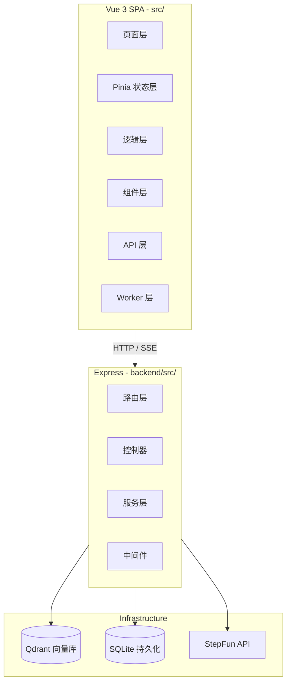
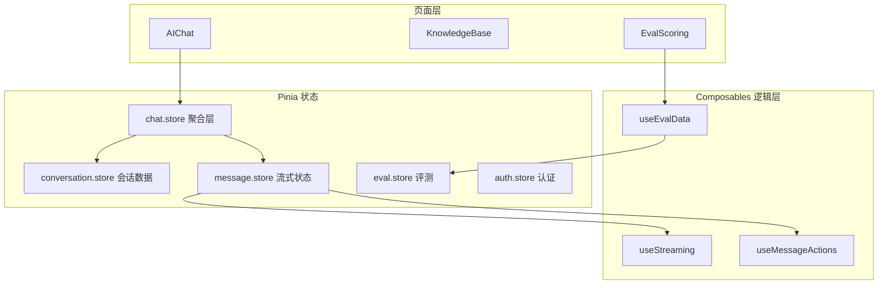
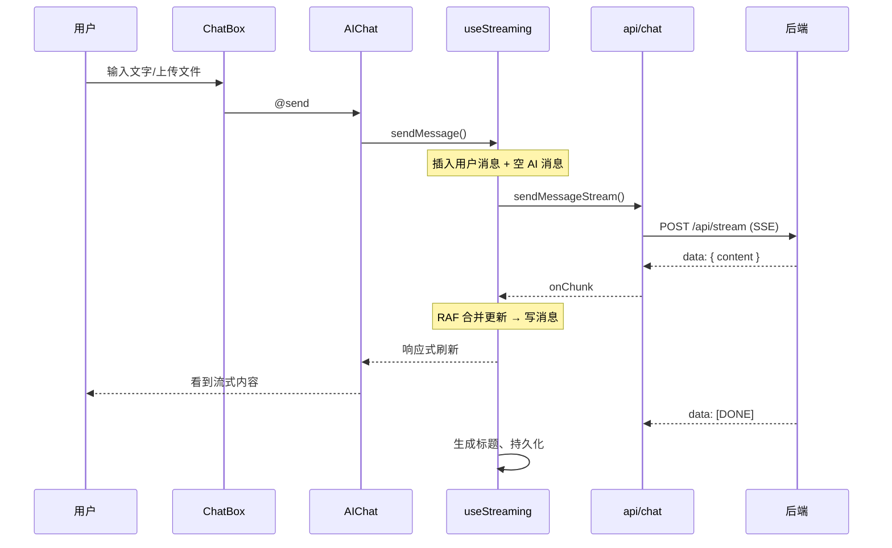
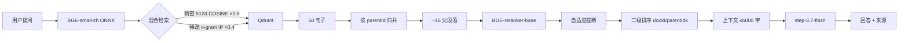
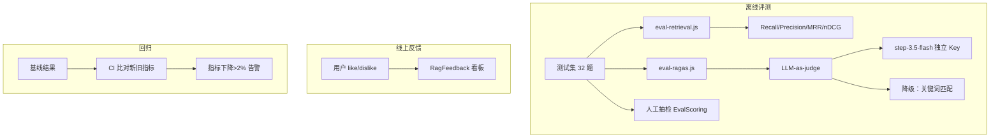
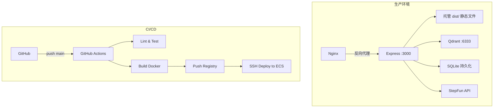

# 武理小精灵 整体架构

> 版本：v0.1 | 最后更新：2026-07-24

## 项目定位

武汉理工大学校园 AI 助手。前后端分离，前端 Vue 3 SPA，后端 Express，向量库 Qdrant（默认，本地文件持久化可切换），本地 ONNX 模型做 Embedding 和 Reranker，LLM 使用 StepFun 阶跃星辰。

---

## 一、系统架构总览



---

## 二、前端架构

### 2.1 技术栈

| 层 | 技术 | 版本 |
|---|------|:----:|
| 框架 | Vue 3 (Composition API) | 3.5.27 |
| 状态管理 | Pinia | 2.1.7 |
| 路由 | Vue Router | 4.6.4 |
| 构建 | Vite | 6.2.0 |
| 样式 | Tailwind CSS | 4.1 |
| 图标 | Lucide Vue Next | 0.344 |
| Markdown | markdown-it + highlight.js + DOMPurify | 14.1 |
| 测试 | Vitest + @vue/test-utils | 4.1 |

### 2.2 目录结构

```text
src/
├── main.js                 # 入口：注册 Pinia/Router/错误处理
├── App.vue                 # 根布局：侧边栏 + 响应式 + 错误边界
├── router/index.js         # 路由表 + 登录守卫
│
├── views/                  # 页面
│   ├── Login.vue           # 教务账号登录
│   ├── AIChat.vue          # 主聊天页
│   ├── KnowledgeBase.vue   # RAG 知识库管理
│   ├── EvalScoring.vue     # 人工评测
│   ├── RagFeedback.vue     # 线上反馈看板（管理员）
│   └── Settings.vue        # 设置页
│
├── stores/                 # Pinia 状态
│   ├── auth.store.js       # 登录态、用户信息
│   ├── chat.store.js       # 聚合层（会话+消息）
│   ├── conversation.store.js  # 会话数据、缓存、后端同步
│   ├── message.store.js    # 流式状态（委托 useStreaming）
│   ├── theme.store.js      # 暗色模式
│   ├── language.store.js   # 中英文文案
│   ├── toast.store.js      # 全局提示
│   ├── eval.store.js       # 评测状态
│   ├── skill.store.js      # Skill 管理
│   ├── mcp.store.js        # MCP Server 配置
│   └── prompt.store.js     # 提示词模板
│
├── composables/            # 可复用逻辑
│   ├── useStreaming.js     # SSE 流式管理
│   ├── useMessageActions.js  # 消息操作
│   ├── useMarkdownRenderer.js  # Markdown 渲染
│   ├── useCodeHighlighter.js  # 代码高亮
│   ├── useMarkdownWorker.js  # Worker 渲染
│   ├── useWebVitals.js    # 性能指标
│   ├── useEvalData.js     # 评测数据
│   ├── useSystemMetrics.js  # 系统指标
│   └── useLazyload.js     # 懒加载
│
├── components/
│   ├── chat/               # 聊天组件
│   │   ├── ChatBox.vue     # 输入框 + 文件上传 + 语音 + 命令
│   │   ├── MessageList.vue # 消息列表
│   │   ├── MessageBubble.vue # 消息气泡
│   │   ├── ConversationList.vue # 会话列表
│   │   ├── MarkdownRenderer.vue  # Markdown 渲染
│   │   ├── CodeBlock.vue   # 代码块
│   │   ├── VoiceRecorder.vue  # 语音输入
│   │   └── ...
│   ├── common/             # 通用组件
│   │   ├── ToastManager.vue
│   │   ├── ErrorBoundary.vue
│   │   ├── ConfirmDialog.vue
│   │   ├── LoginModal.vue
│   │   ├── ProfilePanel.vue
│   │   └── ...
│   ├── layout/             # 布局组件
│   │   ├── Sidebar.vue
│   │   └── MobileSidebar.vue
│   └── eval/               # 评测组件
│       ├── RagasDashboard.vue
│       ├── SystemMetricsPanel.vue
│       └── EvalContentViewer.vue
│
├── api/                    # API 封装
│   ├── client.js           # 基础 fetch 封装
│   ├── chat.js             # SSE 流式 + 连接管理
│   ├── conversations.js    # 会话 CRUD
│   ├── rag.js              # 文档 CRUD + 反馈
│   ├── eval.js             # 评测接口
│   └── school.js           # 教务接口
│
├── workers/
│   └── markdown.worker.js  # Markdown 渲染 Worker
│
└── utils/
    ├── chatHelpers.js      # 消息格式化
    ├── conversationCache.js  # 缓存管理
    ├── markdownConfig.js   # Markdown 安全配置
    └── errorHandler.js     # 错误处理
```

### 2.3 状态管理架构



### 2.4 流式聊天链路



---

## 三、后端架构

### 3.1 技术栈

| 层 | 技术 | 版本 |
|---|------|:----:|
| 运行时 | Node.js | 20+ |
| 框架 | Express | 4.18 |
| 向量库 | Qdrant 独立服务（默认） | 1.19+（文件持久化可切换） |
| Embedding | BGE-small-zh (ONNX) | 本地 |
| Reranker | BGE-reranker-base (ONNX) | 本地 |
| 主模型 | StepFun step-3.7-flash | API |
| Judge 模型 | StepFun step-3.5-flash | API（独立 Key） |
| 持久化 | SQLite / MemoryStore | 本地 |
| 鉴权 | JWT + httpOnly Cookie | - |
| 安全 | Helmet + CORS + rate-limit | - |

### 3.2 目录结构

```text
backend/
└── src/
    ├── app.js              # 服务入口
    ├── config/index.js     # 集中配置
    │
    ├── routes/             # 路由
    │   ├── register.js     # 路由注册 + 静态文件
    │   ├── index.js        # 子路由聚合
    │   ├── auth.routes.js  # 认证
    │   ├── chat.routes.js  # 聊天
    │   ├── rag.routes.js   # 知识库
    │   ├── conversations.routes.js  # 会话
    │   ├── school.routes.js  # 教务
    │   ├── eval.routes.js  # 评测
    │   └── metrics.routes.js  # 指标
    │
    ├── controllers/        # 控制器
    │   ├── chat.controller.js
    │   └── rag.controller.js
    │
    ├── services/           # 服务层
    │   ├── ai.service.js        # LLM 调用（含请求队列）
    │   ├── judge.service.js     # LLM-as-judge **（独立 Key）**
    │   ├── rag.service.js       # RAG 检索管道
    │   ├── embedding.service.js # BGE-small-zh ONNX
    │   ├── vector-store-qdrant.service.js  # Qdrant 独立服务（默认）
    │   ├── vector-store.service.js  # 本地文件持久化（可切换）
    │   ├── reranker.service.js  # BGE-reranker-base
    │   ├── indexing.service.js  # 文档切片索引
    │   ├── document.service.js  # 文档 CRUD
    │   ├── file-upload.service.js  # 文件解析
    │   ├── auth.service.js     # JWT 认证
    │   ├── school-api.service.js  # 教务 CAS
    │   ├── chat.service.js     # 聊天逻辑
    │   ├── memory.service.js   # 记忆系统
    │   ├── metrics.service.js  # 指标采集
    │   └── observability.service.js  # 可观测性
    │
    ├── middleware/
    │   ├── auth.middleware.js  # 登录校验
    │   ├── error.middleware.js # 统一错误处理
    │   └── index.js
    │
    └── utils/
        ├── httpClient.js     # HTTPS 请求（重试+连接池）
        └── response.js       # 统一响应格式
```

### 3.3 配置体系

```env
# AI 生产模型
AI_API_KEY=key_a
AI_MODEL=step-3.7-flash
LLM_CONCURRENCY=3          # 生产并发控制

# AI 评测模型（独立 Key，不抢生产配额）
JUDGE_API_KEY=key_b
JUDGE_MODEL=step-3.5-flash

# 向量库
QDRANT_URL=http://localhost:6333
QDRANT_COLLECTION=wuli_elf_chunks

# RAG 参数
RAG_VECTOR_TOP_K=50
RAG_RERANK_TOP_K=10
RAG_MAX_CONTEXT_LENGTH=6000
```

---

## 四、RAG 检索链路



### 父子段落架构

```text
文档 → 章节合并（按 一、二、三 标题）
     → 段落（父级）
         → 句子（子级，512 维向量化）
检索命中句子 → 按 parentId 去重
     → BGE-reranker 排序
     → 自适应截断（断崖>0.05 + 低分<0.3 + 硬上限=10）
     → 二级排序（docId, parentIdx）
     → LLM 上下文
```

### 关键服务

| 服务 | 文件 | 职责 |
|------|------|------|
| `embedding.service.js` | BGE-small-zh ONNX + n-gram 稀疏 | 512d 稠密 + 整数 key 哈希 |
| `vector-store-qdrant.service.js` | Qdrant 独立服务（默认） | dense+sparse 双查询，客户端加权融合（0.6/0.4 或 RRF 可配） |
| `vector-store.service.js` | 本地文件持久化（可切换） | 精确检索，VECTOR_STORE_BACKEND=file 时启用 |
| `reranker.service.js` | BGE-reranker-base cross-encoder | INT8 ONNX，~145ms/15 候选 |
| `rag.service.js` | 检索管道 | 混合检索→归并→MMR 去重→rerank→截断→排序→组装 |
| `indexing.service.js` | 文档切片 | 中文章节合并→段落→句子 |

---

## 五、评测体系



### 评测维度

| 环节 | 工具 | 指标 |
|------|------|------|
| 检索质量 | `eval-retrieval.js` | Recall@K, Precision@K, MRR, nDCG@5 |
| 生成质量 | `eval-ragas.js` + LLM-as-judge | Faithfulness, Answer Relevancy, Context Precision, Context Recall |
| 人工评分 | `EvalScoring.vue` | 1-5 分主观评分 |
| 线上反馈 | `RagFeedback.vue` | 用户 like/dislike 统计 |
| 回归评估 | 基线比对 | 指标变化 > 2% 告警 |

### LLM-as-judge 设计

| 属性 | 值 |
|------|:----:|
| Model | step-3.5-flash |
| API Key | 独立 Key（不跟生产抢配额） |
| Temperature | 0（确定性输出） |
| Max Tokens | 256 |
| 请求合并 | 4 指标 → 1 次请求 |
| 降级 | 失败 → 关键词匹配 |
| 速率 | 5 并发 / 10 RPM / 5M TPM |

---

## 六、部署架构



---

## 七、环境变量

| 变量 | 说明 | 默认值 |
|------|------|:------:|
| `AI_API_KEY` | 生产模型 Key | - |
| `AI_MODEL` | 生产模型 | step-3.7-flash |
| `LLM_CONCURRENCY` | 生产并发数 | 3 |
| `JUDGE_API_KEY` | 评测模型 Key（独立） | 同 AI_API_KEY |
| `JUDGE_MODEL` | 评测模型 | step-3.5-flash |
| `QDRANT_URL` | 向量库地址 | localhost:6333 |
| `RAG_VECTOR_TOP_K` | 检索候选数 | 50 |
| `RAG_RERANK_TOP_K` | 重排截断上限 | 10 |
| `JWT_SECRET` | JWT 密钥 | - |
| `SCHOOL_ENC_KEY` | 教务密码加密密钥 | - |

---

## 八、关键设计决策

| 决策 | 方案 | 原因 |
|------|------|------|
| 状态管理 | Pinia 拆三层（conversation/message/chat） | 避免一个 store 同时管数据和副作用 |
| 流式更新 | RAF 合并 + visibilitychange 兜底 | 防止后台 Tab 内容堆积 |
| API 并发 | 请求队列 LLM_CONCURRENCY=3 | 防止触发 429 限流 |
| 评测隔离 | 独立 API Key + step-3.5-flash | 不跟生产抢配额 |
| 父子段落 | 句子索引 + 段落上下文 | 减少 token 消耗，保留完整语义 |
| 混合检索 | 默认稠密×0.6 + 稀疏×0.4（`RAG_FUSION=weighted`） | 兼顾语义相似度和关键词精确匹配；RRF 备选（`RAG_FUSION=rrf` + `RAG_RRF_K=10`）实测与加权打平 |
| 认证 | httpOnly cookie | 不暴露 JWT 给前端 JS |
| 存储 | 无 Redis 降级 MemoryStore | 降低部署依赖 |

---

## 九、调优记录（2026-08-09）

### 9.1 前端：收藏标题实时同步

- 问题：收藏时把 `conversationTitle` 快照进 localStorage，会话改名后收藏列表不更新
- 修复：`favorites.store.js` 的 `sortedFavorites` 改为实时关联会话 store 标题（会话 store 是标题唯一事实来源），快照仅作兜底
- 覆盖改名、后端同步覆盖 title 等所有路径；新增 `favoritesStore.test.js`

### 9.2 混合检索融合：加权 → RRF → 回退加权

- 背景：稠密/稀疏 cosine 量纲不可比，0.6/0.4 需校准；曾加 `_terminality` 动态调权补丁
- 尝试：`vector-store.service.js` 支持 RRF（Σ 1/(k+rank)），删除动态调权；官方评测（32 题）RRF(k=60) Recall 74.5% < 加权 80.7%
- k 值复测（`offline-rrf-ab.cjs`）：RRF 差主要是 **k=60 偏大**（排名差异被压扁，CT05 掉出 top5）；k=10 的 RRF 与加权打平（官方 Recall 均 97.4%，MRR/nDCG 微弱领先属噪声级）
- 结论：默认回退 weighted（零超参、更简单）；RRF 保留 `RAG_FUSION=rrf` + `RAG_RRF_K=10` 备选
- ⚠️ 排坑：RRF 排名必须按**句子唯一 id** 计 rank，按 docId 会让同 doc 句子互相覆盖，RRF 被严重低估

### 9.3 MMR 跨文档剔除回归修复

- 问题：父段 MMR 去重（bigram Jaccard ≥0.85 即剔除）把**第二个相关文档整体剔掉**——doc_9a78 与 doc_4dcd 内容几乎相同（相似度 1.0），C01-C08 全部只命中 1 个相关 doc，官方 Recall 从 99% 掉到 80.7%
- 修复：`_mmrDedupe` 相似度剔除仅限**同 docId 内**父段，跨文档高度相似不再剔除
- 效果：官方 Recall 80.7% → **97.4%**，学校概况类 48.5% → 97.0%，C01-C08 全部 100% 命中
- 测试：`rag.mmr-category.test.js` 新增「跨文档高度相似不剔除」用例，后端全量 131 用例通过